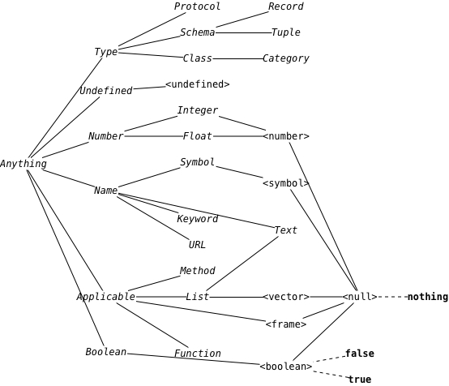

# Bard 0.4

## Introduction

Bard is a small language in the Lisp family that combines a novel approach to types and polymorphic functions with an emphasis on functional style and dynamic programming. It's and extensible, kernel-based language designed to present a small set of generic and self-documenting APIs, and to support an interactive style of programming in which a program is built up incrementally by modifying the Bard system itself. It's intended to be both highly portable and efficient enough for a wide range of programming tasks.

Bard is designed with the assumption that it will be used to write both locally-useful scripts and distributed, network-aware applications. It's intended for writing server applications that run unattended and without a user interface for extended periods, and also for graphical applications that run in a dekstop or mobile environment. It's also intended as a language for writing both the client and server sides of web applications, with compilation to Javascript for use in client-side code.

## Types

### Schemas

A **schema** is a concrete type that describes the representation of a family of values. In other words, it describes concretely how to lay out bits and bytes to represent values of a certain type. Every Bard value is an instance of exactly one schema.

`<undefined>` represents results of computations that are not valid values, such as the values of unbound variables, or the return values of undefined functions. It has exactly one instance, the value `undefined`, and exactly one superclass, `Anything`. It has no subclasses.

Every schema besides `<undefined>` has exactly one subclass: the schema `<null>`, making the value `nothing` an instance of every type. No schema may have any subclasses except `<null>`.

A schema may have any number and variety of superclasses, but they must all be abstract types--either **classes** or **categories**.

### Built-in schemas

**`<boolean>`**

**`<frame>`**

**`<null>`**

**`<number>`**

**`<symbol>`**

**`<undefined>`**

**`<vector>`**

### User-defined schemas

You can define your own schemas using the special form `define record`. Schemas defined using `define record` behave exactly like built-in frames, but they must have values for all required keys. Be aware that if you use the `Frames` protocol to remove a required key from an instance of a user-defined record then the result is not an instance of the schema.

**`define record`**

    (define record <point> 
      (x type: Float default: 0 mutable: false required: true)
      (y type: Float default: 0 mutable: false required: true))

### Classes

A **class** is an abstract type that names a collection of other types. The collected types are called **members** of the class. An instance of any member of a class is also an instance of the class.

All Bard classes are purely abstract, with no behavior of their own and no data fields. It is not possible to create a direct instance of a class; all values are instances of schemas. In order to be an instance of a class, a value has to be an instance of some schema that is a member of the class.

A class may be a member of any number of other classes and **categories**.

Types that are members of a class are called its **subclasses** or its **subtypes** (the terms are interchangeable).

The classes and categories of which a class is a member are called its **superclasses** or **supertypes**.

Bard provides a set of built-in classes arranged in a graph of superclass/subclass relations.

*Built-in classes and schemas*

### Built-in classes

**`Anything`**

**`Applicable`**

**`Boolean`**

**`Class`**

**`Float`**

**`Frame`**

**`Function`**

**`Integer`**

**`Keyword`**

**`List`**

**`Method`**

**`Name`**

**`Null`**

**`Number`**

**`Protocol`**

**`Record`**

**`Schema`**

**`Symbol`**

**`Text`**

**`Tuple`**

**`Type`**

**`Undefined`**

**`URL`**

### User-defined classes

**`define class`** 

### Categories

A **category** is a class that is defined by a predicate function called a **criterion**. A **criterion** is a function that accepts one argument and returns `true` or `false`; if it returns `true` then its argument is an instance of the criterion's category; otherwise, it isn't.

Categories can be used to create classes with arbitrary values as instances. For example, you can create an `OddIntegers` category using the built-in functions `integer?` and `odd?`:

    (define category OddIntegers 
      (^ (x) (and (integer? x) 
                  (odd? x))))

**`define category`** 

## Protocols

A protocol is an object that describes a set of functions. It defines the names of the functions and the classes of their input and output values. A protocol definition does not define the implementations of the functions.

### Functions

### Methods

### Built-in Protocols

#### Addressing

**`url-domain`** 

**`url-path`** 

**`url-port`** 

**`url-query`** 

**`url-scheme`** 

#### Calculating

**`+`** 

**`-`** 

**`*`** 

**`/`** 

**`%`** 

**`abs`** 

**`acos`** 

**`asin`** 

**`atan`** 

**`ceiling`** 

**`cos`** 

**`exp`** 

**`floor`** 

**`log`** 

**`max`** 

**`min`** 

**`power`** 

**`random`** 

**`round`** 

**`sin`** 

**`sqrt`** 

**`tan`** 

#### Constructing

**`copy`**

**`deep-copy`**

**`make`** 

**`type-for-copy`** 

#### Converting

**`as`** 

**`combined-type`** 

#### Equality

**`=`** 

**`identical?`** 

#### Frames

**`drop-key`** 

**`get`** 

**`keys`** 

**`merge`** 

**`put`** 

**`select`** 

**`vals`** 

#### Functions

**`^`** 

**`->`** 

**`apply`** 

**`cascade`** 

**`compose`** 

**`conjoin`** 

**`disjoin`** 

**`flip`** 

**`function?`** 

**`functional?`** 

**`method?`** 

**`partial`** 

**`repeatedly`** 

**`rotate-left`** 

**`rotate-right`** 

**`rpartial`** 

#### Lists

**`add-first`** 

**`add-last`** 

**`any`** 

**`by`** 

**`coalesce`** 

**`concat`** 

**`concat2`** 

**`drop`** 

**`drop-while`** 

**`element`** 

**`empty?`** 

**`every?`** 

**`filter`** 

**`find`** 

**`first`** 

**`generate`** 

**`indexes`** 

**`interleave`** 

**`interpose`** 

**`join`** 

**`join2`** 

**`last`** 

**`length`** 

**`map`** 

**`match-prefix?`** 

**`match-suffix?`** 

**`next-last`** 

**`partition`** 

**`position`** 

**`position-if`** 

**`range`** 

**`range-from`** 

**`reduce`** 

**`remove`** 

**`repeat`** 

**`rest`** 

**`reverse`** 

**`scan`** 

**`scan-map`** 

**`second`** 

**`shuffle`** 

**`some?`** 

**`split`** 

**`sublist`** 

**`tails`** 

**`take`** 

**`take-by`** 

**`take-while`** 

**`unique`** 

**`unzip`** 

**`zip`** 

#### Messaging

**`send`** 

**`receive`** 

#### Ordering

**`<`** 

**`<=`** 

**`>`** 

**`>=`** 

**`sort`** 

#### Pairs

**`left`** 

**`pair`** 

**`right`** 

#### Streams

**`characters`** 

**`close`** 

**`input-stream?`** 

**`lines`** 

**`objects`** 

**`octets`** 

**`open`** 

**`output-stream?`** 

**`read-sequence`** 

**`stream?`** 

**`stream-element-type`** 

**`stream-eof?`** 

**`stream-direction`** 

**`stream-mode`**
(append, supersede, overwrite) 

**`stream-open?`**

**`stream-position`**

**`write-sequence`** 

### User-defined protocols

**`define protocol`** 

## Special forms and macros

**`begin`**

**`case`**

**`cond`**

**`def`**

**`define class`**

**`define macro`**

**`define method`**

**`define protocol`**

**`define record`**

**`define variable`**

**`ensure`**

**`generate`**

**`if`**

**`let`**

**`loop`**

**`match`**

**`quasiquote`**

**`quote`**

**`repeat`**

**`setter`**

**`set!`**

**`undefine`**

**`unless`**

**`values`**

**`when`**

**`with-exit`**

**`with-open`**

